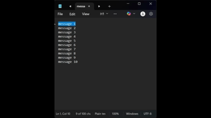

# Windows Clipboard Manager

A lightweight clipboard history tool for Windows.  
Runs silently in the background, stores your last **10** clipboard entries, and lets you paste them quickly with **hotkeys**.

---

##  Features
- Tracks the last **10** clipboard entries (text only).  
- Paste any entry using hotkeys:
  - `Ctrl+Shift+1` → most recent
  - `Ctrl+Shift+2` → second most recent
  - … up to `Ctrl+Shift+0` for the 10th.
- Invisible message-only window (no main UI).
- Minimal dependencies — pure Win32 API + modern C++.
- Extremely lightweight

---

## Quick Usage
1. Build and run the program.
2. Copy text normally (`Ctrl+C`).
3. Use `Ctrl+Shift+<number>` to paste from history.

Example: copy three snippets, then `Ctrl+Shift+1` pastes the most recent; `Ctrl+Shift+3` pastes the third most recent.

---

## 🔧 Build Instructions

### Requirements
- Windows 10 / 11  
- Visual Studio 2019+ (or any compiler with C++17 support)  
- [CMake](https://cmake.org/) (optional, but recommended for cross-toolchain builds)

---

### Build with Visual Studio
1. Clone the repository:
    ```sh
   git clone https://github.com/CalebHellmund/ClipboardManager.git
   cd ClipboardManager
    ```
2. Open the project/solution in Visual Studio.

3. Select the Release configuration.

4. Build and run.

### Build with CMake
1. Clone the repository:

```sh
git clone https://github.com/CalebHellmund/ClipboardManager.git
cd ClipboardManager
```
2. Configure and build:

```sh
cmake -S . -B build
cmake --build build --config Release
```
3. The executable will be in:
```
build/Release/clipboard-manager.exe
```

## Demo


## Implementation Notes
Only CF_UNICODETEXT is supported.

Hotkeys may conflict with other applications — RegisterHotKey can fail if a combo is already taken.

`Ctrl+V` still works normally.

## Future Improvements
- System tray icon with menu (toggle, exit, open history UI).

- Config file (JSON) to adjust buffer size and hotkeys.

- Persistent history (save/load to disk).

- Minimal GUI for viewing/editing history entries.

## License
This project is released under the MIT License. See LICENSE for details.